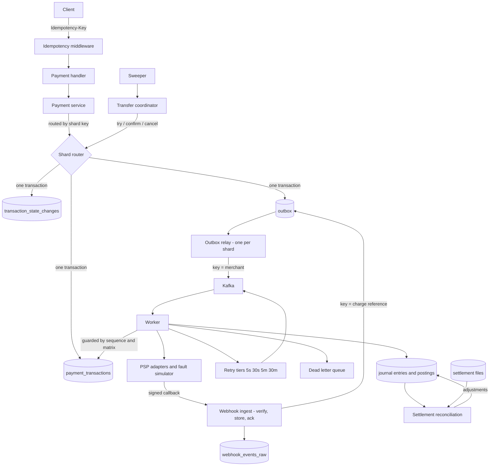

# Payment Orchestration Platform

[](https://github.com/lqtrung-95/payment-orchestration/actions/workflows/ci.yml)

A multi-PSP payment orchestrator in Go, built around one idea: **everything
interesting in a payment system comes from things going wrong.**

A provider that times out *after* charging the card. A webhook delivered five
times, out of order, before the API call that created the transaction returned.
A settlement file that disagrees with your ledger by three cents. The happy path
is a CRUD app; the failure paths are the actual problem.

> **Status: in progress — 7 of 10 phases complete.**
> Built and tested: ledger, state machine, idempotency, provider abstraction, a
> provider simulator that fails on purpose, an asynchronous pipeline —
> transactional outbox, Kafka, error-aware retries, DLQ — and webhook ingestion
> with deduplication and out-of-order tolerance, capture posting to a
> double-entry ledger, and settlement reconciliation with an eight-category
> break taxonomy.
> Metrics, distributed tracing, a continuous invariant checker, and measured
> load numbers are in. Merchants are routed to physical databases by shard key,
> and money crosses between them with try-confirm-cancel.
> Everything claimed below is verified by tests in this repo — see
> [Verified behaviour](#verified-behaviour). Nothing here is aspirational; the
> roadmap is kept separate, at the bottom.


*`make demo` — seven scenarios against a provider that fails on purpose. Every
claim it narrates is asserted, and it exits non-zero if any stops holding.*

---

## The guarantees, and what enforces them

The design principle throughout: **a rule that matters is enforced by the
database, not by convention.** Application code gets bypassed by migrations,
admin sessions, and repair scripts. Money bugs found in production are almost
never "someone forgot to validate" — they are "the validation existed in one of
the four places that write this table."

| Guarantee | Enforced by | Bypassable? |
|---|---|---|
| Journal entries balance per currency | `DEFERRABLE` constraint trigger, fires at COMMIT | No |
| Ledger history is immutable | `BEFORE UPDATE OR DELETE` triggers reject both | No |
| A posting can't touch a different-currency account | Composite FK on `(account_id, currency)` | No |
| Can't capture more than authorised | `CHECK (captured_minor <= amount_minor)` | No |
| Can't refund more than captured | `CHECK (refunded_minor <= captured_minor)` | No |
| Illegal state transitions | Trigger against a transition table **+** Go aggregate | No |
| One key ⇒ one execution | `UNIQUE (merchant_id, key)` inside a committed tx | No |
| Concurrent writers can't clobber | `version` column, optimistic lock | No |
| A payment is never failed on an unknown outcome | `GetStatus` recovery; unresolved stays non-terminal | No |
| Queued work is never lost or invented | Outbox row written in the domain transaction | No |
| A declined payment is never retried | Retry policy keyed on the error class | No |
| A capture never exceeds its authorisation | Checked before the provider call, by the aggregate, and by a `CHECK` | No |
| A break can't be closed anonymously | `CHECK` requiring actor, reason, and timestamp | No |
| A webhook is processed once | `UNIQUE (provider, provider_event_id)` | No |
| A stale webhook can't move a transaction backwards | `last_applied_event_seq` high-water mark, under a row lock | No |
| A webhook can't invent a payment | Correlation only; no insert path from ingestion | No |

Three of these deserve explanation.

**Balance is checked at COMMIT, not at INSERT.** A journal entry is legitimately
unbalanced between its first and last posting, so a normal trigger would reject
every valid entry. A `DEFERRABLE INITIALLY DEFERRED` constraint trigger fires
once, at commit, when the entry is whole.

**The state machine is declared twice** — as a map in Go and as rows in
Postgres — and a test proves the two identical. Two encodings of one rule drift
apart unless something compares them, and a drift means the application believes
a transition is legal that the database will reject at runtime, or worse, the
reverse.

**Idempotency ownership is decided by a unique constraint, not a read-then-write.**
The claim is committed *before* the handler runs. Until the in-flight row is
visible to other connections, a concurrent request carrying the same key finds
nothing and concludes it may proceed — which is precisely how double charges
happen.

## Balances are derived, never stored

`postings` are insert-only; balances are computed by aggregating them. A stored
balance is a second source of truth that drifts from the entries it summarises,
and once it has drifted there is no way to tell which of the two is wrong.

The ledger records **money that moved, not intent**. Creating or authorising a
payment posts nothing — an authorisation is a hold at the issuer, not a
transfer. Postings begin at capture. Booking authorisations would inflate every
balance by the value of holds that may never be captured, and reconciliation
against a settlement file would never match.

Money is `int64` minor units plus an ISO-4217 currency, with no float
constructor anywhere in the codebase. Proportional amounts (fees, splits) go
through an allocation that distributes the truncation remainder, so parts always
sum back to the original exactly.

## Failure handling

A provider call can fail in a way that says nothing about whether the money
moved: the charge is recorded and the response is lost. Retrying charges twice.
Marking it failed writes off money the customer actually paid. Every provider
error is normalized into one of three categories, each with a different answer:

| Category | Examples | Response |
|---|---|---|
| **Terminal** | declined, insufficient funds, suspected fraud | Fail it. Never retry. |
| **Retryable** | rate limited, provider unavailable | Leave open. Nothing happened. |
| **Ambiguous** | timeout, network error, **HTTP 500** | Ask `GetStatus`. Never retry blind. |

A 500 is ambiguous, not a failure — the provider may have recorded the charge
and then fallen over while replying. An unrecognised error also defaults to
ambiguous, because guessing "it failed" is how a real payment gets lost.

When nothing can be established — the provider is unreachable, or its status
endpoint lags — the transaction stays **non-terminal** and says so. A false
"authorized" is recoverable by reconciliation; a false "failed" is money quietly
gone. See [ADR 0006](docs/adr/0006-ambiguous-provider-outcomes-are-resolved-not-guessed.md).

### Retries are driven by the error class

"Retry everything a few times" is wrong in both directions — it repeats declines
and it retries ambiguous failures blindly. The policy is keyed on the taxonomy:

| Class | Policy |
|---|---|
| `Timeout`, `NetworkError` | Retry, but confirm via `GetStatus` first |
| `Unknown` | One confirmation attempt, then alert |
| `RateLimited`, `Unavailable` | Retry on the slower tiers |
| `Declined`, `InsufficientFunds`, `DoNotHonor` | **Never** |
| `SuspectedFraud` | Never, and alert |
| `InvalidInstrument` | Never, until re-verified |

Delay is modelled as four topics (5s / 30s / 5m / 30m) whose consumers wait
until a message is due, not as sleeps inside a handler — a consumer restart must
not lose scheduled retries. Backoff uses **full jitter**, because callers that
back off deterministically all wake at the same instant and knock a recovering
provider straight back over.

Exhausting the ladder parks the message in a DLQ with its reason and origin.
Nothing is dropped. `dlqctl` lists and replays, and replay demands `--actor` and
`--reason` — it moves money, and the first question afterwards is always who
decided to.

### Webhooks are untrusted, duplicated, and out of order

Providers report outcomes by calling back, and those callbacks arrive more than
once, in the wrong order, and sometimes *before* the API response that created
the state they describe. For the asynchronous provider a callback is the only way
an outcome is ever learned.

Ingestion does as little as possible — verify the signature, store the raw bytes,
queue, return 200 — because a provider that gets a slow answer times out and
redelivers, multiplying load exactly when the receiver is least able to absorb
it. Everything that interprets the event happens afterwards.

| Situation | Answer |
|---|---|
| Same event delivered again | Unique index on `(provider, event_id)`; **200**, never an error |
| Bad or missing signature | 401, and nothing is written — a public endpoint that stores what it is sent is a write amplifier |
| Valid signature, old timestamp | 401. Without a window, one captured request replays forever |
| Event older than what was applied | `superseded` — recorded, never applied, never dropped |
| Event implying an impossible move | `rejected` by the transition matrix, structurally |
| Event confirming the current state | `ignored`. Writing it as a transition would show a payment authorized twice |
| No transaction matches yet | Deferred and retried. **A webhook never creates a transaction** |
| Still unmatched after the ladder | `unmatched` + DLQ. A person decides |

Staleness is judged by the provider's own sequence, never by arrival order —
timestamps come from whichever provider host emitted the event, and two hosts
routinely disagree about which of two events came first.

The raw payload is stored as **bytes, not JSONB**: the signature was computed
over those exact bytes, and normalising them means the stored event can never be
verified again. `webhookctl replay` re-reads the log and reports what would
change; a healthy log changes nothing.

### Merchants live on different databases

Sixty-four logical shards, derived from the merchant and stored on every row.
The number of *physical* databases behind those 64 slots is configuration.

The physical count is constrained to a power of two that divides 64, and that
constraint is the whole point. Doubling it splits every existing range exactly
in half, so growing capacity is *"copy logical shards 32–63 to the new
database"* — a contiguous bulk move, verifiable by counting rows per shard key,
that leaves the other half untouched. Hashing merchants straight onto databases
would make adding one a rehash of the entire data set, taken while money is
moving.

Routing reads the **stored** key, never re-derives it. Re-deriving means a
change to the hash function silently sends reads to a database that does not
hold the rows.

Three consequences, all deliberate:

- **There is no lookup by payment id alone.** `Authorize` takes the merchant
  explicitly. Finding a payment from its id would mean querying all 64 shards,
  which makes every read as expensive as the largest deployment. This is the
  cost sharding actually imposes, paid at the API boundary rather than hidden
  behind a fan-out.
- **One outbox relay per shard.** The outbox row is written in the same
  transaction as the payment, so it lives where the payment lives. A single
  relay would leave every other database's events unpublished — payments
  accepted and never acted on.
- **The invariant checker sums across shards.** One that read only shard 0 would
  report zero while another database was unbalanced.

The webhook log, the consumer dedup index, and the transfer coordinator's own
state stay on shard 0, because none of them has a merchant to partition on: a
webhook arrives before any payment has been resolved from it, and an event id
carries no merchant at all.

Unset configuration means one database holding all 64 logical shards —
identical behaviour to before any of this existed.

### Moving money between two databases

Postgres cannot commit across databases. A transfer between merchants on
different shards therefore has no transaction available to it, and the
alternatives are worse than they look: two independent commits lose money when
the second one crashes, two-phase commit blocks until a human intervenes, and a
saga compensates a completed transfer with a reverse transfer — which is not an
inverse, because the funds were spendable in between.

So it runs as **try-confirm-cancel**:

```
try      reserve funds on both shards — nothing posted, balance unchanged
         ── commit point: durable before either side posts ──
confirm  post a balanced entry on each shard, release the holds
cancel   release the holds; there is nothing to undo
```

**The commit point is the entire design.** Before it, the transfer may be
cancelled freely. After it, every participant has already agreed and the
transfer is *owed* completion — a failing confirm is retried, never converted
into a cancel. That one rule is what lets a sweeper look at a transfer whose
coordinator died and know what to do without asking anyone.

Each shard posts a balanced entry against a **suspense account**:

```
source shard:       Dr merchant payable    Cr transfer suspense
destination shard:  Dr transfer suspense   Cr merchant payable
```

Each entry balances inside its own database, which it must — the balance trigger
is per-entry and the databases share nothing. Across shards the suspense legs
are equal and opposite, so **the system-wide suspense position is zero whenever
nothing is in flight**, and a non-zero total is precisely the signal that one
half completed and the other did not. Between the two confirms it is
legitimately non-zero; that window is what a distributed transfer honestly is.

Available balance subtracts outstanding holds, under a transaction-scoped
advisory lock on the merchant and currency. Without the lock, two transfers of
600 against a balance of 1,000 both read the same figure before either inserts,
and both pass a check that was correct when it ran. Removing it and re-running
the concurrency test overdraws the account to −200 — which is how the lock was
confirmed to matter rather than assumed to.

### Settlement reconciliation

A provider's file and our ledger disagree constantly, and *"the totals don't
match"* is not a finding — it is the absence of one. An operator needs to know
whether to chase the provider, fix an ingestion gap, wait for the next file, or
write the difference off. Those are four responses, so there are eight
categories:

| Category | Meaning | Auto-resolvable |
|---|---|---|
| `duplicate_settlement` | The provider settled one charge twice | No |
| `currency_mismatch` | Currencies disagree outright | No |
| `fx_drift` | Difference explained by the rate moving | **Yes** |
| `fee_mismatch` | Net differs by the fee — schedule drift | No |
| `amount_mismatch` | Amounts differ, nothing explains it | No |
| `timing_cutoff` | Settles in the adjacent window, not missing | **Yes** |
| `missing_internally` | Settled at the provider, absent from our books | No |
| `missing_at_psp` | Captured by us, absent from the file | No |

**The order is load-bearing.** A duplicate settlement also presents as an amount
mismatch; so does FX drift. Testing the specific explanations before the general
one is what stops every break landing in the vaguest bucket that fits —
reordering the classifier silently degrades it into a single "amounts differ"
category.

`fx_drift` is decided by reproducing the provider's own arithmetic, not by size:
*does applying the rate it says it used produce the figure it sent?* A
difference of the right size for the wrong reason is still unexplained, and
treating size alone as the criterion is how a real error gets closed as drift.
Only the two *explained* categories may auto-resolve.

Reconciliation reads the **ledger**, not `payment_transactions.captured_minor`.
The column says what the service intended to record; the postings say what was
actually accounted for. Comparing against the column would compare the provider
to our own intent and quietly agree with itself.

Matching is exact on the provider reference. A fuzzy fallback on amount and date
is deliberately absent: pairing two records because they share an amount and a
day produces a confident wrong answer, and nobody ever re-examines a confident
one.

Re-running is safe — breaks carry a natural identity, so a repeat run recognises
the same disagreement rather than raising it again, and any decision recorded
against it survives. Closing a break demands an actor and a reason, enforced by a
`CHECK` as well as in Go.

The two explained categories close themselves, and for opposite reasons. FX
drift is real money, so it writes the adjustment — `Dr clearing / Cr fx gain
and loss` in the settlement currency — and the break links to the entry that
justifies it. A timing cutoff moves nothing, so it posts nothing; inventing an
entry there would invent a movement. The automated actor is still recorded,
because *"who closed this"* needs an answer even when the answer is "nobody".

### The provider misbehaves on purpose

`cmd/pspsim` is a separate process implementing a deliberately unreliable
provider. Faults are tunable at runtime — the demo is toggling them while
traffic flows — and every verdict is derived from a seed plus the request
identity, so a chaos run replays exactly rather than approximately.

| Fault | What it forces |
|---|---|
| `timeout_after_success` | Charge recorded, connection hangs. The flagship case. |
| `error_5xx_after_success` | Same, wearing an HTTP status code |
| `duplicate_webhook` | Deduplication against a unique index |
| `out_of_order_webhook` | The staleness guard, judged by provider sequence |
| `webhook_before_response` | A callback arriving before the API reply |
| `slow_response` | Timeout budgets |
| `partial_capture_drift` | A reconciliation break, not an error |
| `stale_status` | Recovery cannot assume the provider is read-consistent |

Three provider shapes, deliberately not interchangeable: synchronous,
asynchronous (resolves only by webhook), and redirect-based (3-D Secure style).
Two adapters with identical semantics would prove nothing.

Declines are triggered by magic amounts, the way real sandboxes work — the last
two digits are the actual ISO-8583 response code, so an amount ending in `51`
declines for insufficient funds.

## Verified behaviour

Measured on this repo, not projected. 170 tests, green in
[CI](https://github.com/lqtrung-95/payment-orchestration/actions/workflows/ci.yml)
against a real Postgres.

**Idempotency, end to end over HTTP** — 50 concurrent `POST /v1/payments`
carrying one idempotency key, with a real provider call in the request path:

```
41 × 201   (1 execution + 40 replays)
 9 × 409   (in-flight, told to retry)
------------------------------------
transactions created:  1
provider charges:      1
```

Replays are **byte-identical** to the original response. Reformatted JSON — same
content, reordered keys, different whitespace — still replays rather than being
rejected. The same key with a *different* body returns 409 rather than silently
replaying, which would discard the second payment.

**Money** — a 20,000-case property test asserts allocation never creates or
destroys a minor unit, for any amount and any ratios. Overflow is detected on
add, subtract, negate, multiply, and inside allocation.

**Ledger** — unbalanced entry rejected at commit; empty entry rejected;
cross-currency posting rejected; `UPDATE`/`DELETE` on postings rejected. Invariant
`sum(debits) = sum(credits)` holds across a 25-entry three-way fee split.

**Concurrency** — 20 concurrent writers on one transaction: version advances
exactly once per winner, every loser gets a typed conflict error rather than
silently losing its write.

**Ambiguous-failure recovery** — with `timeout_after_success` forced to 100%,
and again with `error_5xx_after_success` at 100%: the transaction reaches
`authorized` with **exactly one charge** at the provider. The tests assert the
audit trail contains *recovered after ambiguous failure*, so they cannot pass
vacuously if the fault stops firing.

**Nothing terminal without evidence** — provider outage, and the provider
process killed outright mid-flow: the transaction stays `authorizing`, never
`failed`. Only a genuine decline reaches a terminal state.

**Reproducible chaos** — the same seed produces identical fault verdicts
regardless of call order or concurrency; different seeds diverge.

**Asynchronous pipeline, over real Kafka** — create → outbox → relay → Kafka →
worker → authorized, with isolated topics per test run. A decline reaches
`failed` with zero provider charges and zero retry-tier messages. A duplicate
delivery does not run the work twice. Exhausted retries land in the DLQ without
the transaction being marked failed.

**No duplicate publishes** — four concurrent publishers over 120 messages
deliver each exactly once. This test caught a real bug: `FOR UPDATE SKIP LOCKED`
alone released its locks when the claim transaction committed, so every
publisher re-sent the same batch. Claiming by lease fixed it.

**A rolled-back payment leaves no queued work**, and a committed one leaves
exactly one message — the property the outbox exists for.

**Reconciliation** — a generated settlement file with one deliberate defect of
each kind, plus a clean payment that must not produce a break:

```
all 8 categories detected and correctly classified
clean payment reconciles silently — no manufactured breaks
fx_drift distinguished from amount_mismatch at the same delta
re-running the same file       0 new breaks
re-ingesting identical bytes   recognised, not duplicated
```

**Capture posts a balanced entry** — debits equal credits, and payable plus fee
equals clearing, so no minor unit is created or destroyed. A capture that
exceeds its authorisation never reaches the provider at all; the test asserts
the provider's charge count, because asserting only "an error was returned"
passes whether or not the customer was charged.

**Rounding is unbiased** — zero drift across a thousand exact ties, which
half-up fails.

**Money is conserved across databases** — 120 concurrent transfers between eight
merchants split over two real Postgres databases. The total owed to merchants
across both is unchanged to the cent, the suspense position is zero, no hold is
left outstanding, and no merchant is overdrawn. Deleting either half of the
confirm shows up in all three assertions at once.

**A killed coordinator strands nothing** — a transfer abandoned *before* the
commit point has its holds released and the funds become spendable again; one
abandoned *after* it is completed by the sweeper, with the destination credited
and suspense returned to zero. Sweeping a finished transfer three more times
posts nothing further.

**Routing is physical, not filtered** — a merchant's payment, its audit rows,
and its outbox row are present in one database and *absent* from the other.
Verified against two databases created and migrated by the test itself.

**Correctness under load** — across **164,933 payments** created by k6 against
the live stack: zero ledger imbalance, zero double charges, zero lost payments.
Four requests failed, all `statement timeout` on the idempotency claim while the
host was badly oversubscribed — the system shed work rather than corrupting
state. The invariant checker runs *during* the load, because a run that reports
throughput while the ledger is quietly unbalanced is a failed run that looks
like a passing one. It is itself tested against seeded violations: a checker
that always returned zero would pass every load test ever run against it.

**Under load, with the provider failing ~30% of requests** — measured, not
projected; hardware and commands in [`docs/benchmarks/`](docs/benchmarks/README.md):

```
accepted                 453 req/s
server errors            0  of 55,767
double charges           0
lost payments            0
ledger imbalance         0
provider charges         177, against 177 transactions that reached it
```

The invariants were exported *during* the run by a checker that runs on a
timer, not computed afterwards. A throughput number measured while correctness
was silently broken is a failed run that looks like a passing one — and there
are tests that plant a violation to prove the checker actually notices.

The same run found the real limit: **ingestion scales, processing does not.**
55,590 payments sat at `created` behind 42,409 pending outbox rows, because the
worker consumes with one goroutine making synchronous provider calls. That is
correct queue behaviour — accept durably, drain at the downstream's pace — but
the drain rate is not horizontal, and it is now two gauges instead of an
archaeology exercise.

**One trace, two processes, both boundaries crossed:**

```
payment-orchestrator  POST /v1/payments                     59ms
payment-orchestrator  kafka.publish payment.authorize       10ms
payment-worker        kafka.consume payment.authorize       37ms
payment-worker        psp psp-async-sim /v1/charges/authorize 2ms
```

Crossing Kafka needs the trace context in record headers. Crossing the *outbox*
needs it in the database row — the handler commits and returns while the relay
publishes later in another goroutine, so without a stored `traceparent` the
trace starts at the relay and the request that caused the payment is missing
from its own story.

**Webhooks under chaos** — 30 payments against the asynchronous provider with
every webhook fault live, so the outcome could only ever arrive by callback:

```
payments resolved        30 / 30 authorized
provider charges         30 distinct   (no double charges)
webhook requests         65 — all 200
  duplicates absorbed    24
events stored            41 unique
  applied 28 · superseded 7 · ignored 6
duplicate audit rows     0
worst ingest latency     6.4ms
webhookctl replay        41 events, 0 would change state
```

Delivered 100× in a row, one event produces one stored row and one transition.
Delivered in fully reversed order, three events reach the same final state as
forward order. An unverified payload persists nothing. Stored bytes still verify
against the signature that arrived with them.

Three real bugs came out of this phase, and two of them were invisible to the
tests that existed at the time:

- **A sequence of `0` was treated as "no sequence"** and replaced with a
  timestamp — turning the *oldest* event in a batch into the newest and silently
  disabling the staleness guard for exactly the delivery it exists to catch.
- **Confirmations were recorded as transitions.** Same-state moves are legal, so
  a payment resolved by the recovery path and then confirmed by its callback
  showed two `authorized` rows — 15 rows for 12 payments in the first live run.
- **A deferred retry stalled the whole consumer.** The delay tiers slept in the
  handler, and every partition's records are processed by one goroutine, so one
  message on the 5-minute tier held **20 live payments at `created`**. Found by
  reading consumer-group lag during a demo, not by a test. Partitions are now
  paused and rewound instead. The regression test was checked against the old
  behaviour to confirm it actually fails.

## Try it

Requires Go 1.26+ and a container runtime.

The fastest path is the narrated demo. It starts the stack, the provider
simulator, the API, and a worker; walks through seven scenarios; and tears
everything down:

```bash
make demo
```

Every claim it narrates is asserted, and it exits non-zero if any of them stops
holding — `make demo-verify` runs it without the pauses. A demo nobody verifies
rots silently, and the worst place to find that out is on camera.

The recording above was produced from that same script, so it cannot drift from
what the code actually does:

```bash
asciinema rec docs/demo.cast --overwrite --idle-time-limit 2 -c "make demo"
agg --theme monokai --font-size 16 --speed 1.2 docs/demo.cast docs/demo.gif
```

To drive it by hand instead:

```bash
cp .env.example .env
make up            # postgres, redis, kafka — waits until healthy
make migrate-up
make run
```

Start the worker and the provider simulator in separate terminals:

```bash
make pspsim        # the provider that fails on purpose
make worker        # consumes Kafka, calls providers
```

Create a payment:

```bash
curl -X POST http://localhost:8080/v1/payments \
  -H 'X-Merchant-Id: m_acme' \
  -H 'Idempotency-Key: order-1001' \
  -H 'Content-Type: application/json' \
  -d '{"amount":12550,"currency":"USD"}'
```

The response comes back in the `created` state in a few tens of milliseconds:
authorization happens in the worker, so the caller never waits on a third party.
`GET /v1/payments/{id}` shows it reach `authorized`.

Send it again with the same key — you get the identical response and an
`Idempotency-Replayed: true` header, and no second transaction. Send it with a
different amount and the same key, and you get a 409.

Amounts are integer minor units. `{"amount":125.50}` is rejected at the boundary
rather than truncated, and so is a typo like `"currrency"`.

Run it against the misbehaving provider:

```bash
make chaos         # switch fault injection on while traffic flows
make outage        # take the provider down for 30s
```

To see the webhook path carry the outcome, run the worker against the
asynchronous provider — it answers `pending`, so a callback is the only way the
payment ever resolves:

```bash
PSP_DEFAULT_PROVIDER=psp-async-sim make worker
```

Under `make chaos` that callback arrives duplicated, out of order, and sometimes
before the API response. Every delivery is answered 200, and the payment reaches
`authorized` exactly once. Then check the log is safe to replay:

```bash
make replay        # re-evaluates every stored event; a healthy log changes nothing
```

To run it sharded, create a second database and point the service at both. The
migration runner applies to every shard listed, and reports all failures
together:

```bash
docker compose -f deploy/docker-compose.yml exec postgres createdb -U payment payment_shard1
```

Then set `POSTGRES_SHARD_DSNS` to both DSNs (the commented example in
`.env.example` is exactly this) and run `make migrate-up`. The service logs
`physical_shards=2` at boot and starts one outbox relay per shard; payments for
different merchants now land in different databases.

Move money between two of them:

```bash
go run ./cmd/transferctl send -from merchant-a -to merchant-b -amount 12500 -key demo-1
```

The output states which database each side resolved to and whether the transfer
actually crossed. `make transfers` lists anything still in flight, and
`make sweep` resolves transfers whose coordinator stopped.

```bash
make test          # includes integration tests against the live stack
make check         # fmt, vet, lint, test
```

## Architecture



Everything drawn exists. The transaction, its audit row, and the queue message
are written in **one** database transaction, on the database the merchant hashes
to — that atomicity is what makes queued work neither lost nor invented, and it
is why the outbox relay runs once per shard. Postings begin at capture.

One service with enforced module boundaries, deliberately not microservices — a
distributed monolith would be a worse design, not a better one, at this size.

```
cmd/          orchestrator, worker, migrate, pspsim, dlqctl, webhookctl, reconctl, transferctl
internal/
  domain/     money, ledger, transaction   — no I/O, no framework types
  store/      repositories                  — take a Querier, so callers own the tx boundary
  psp/        provider contract, error taxonomy, retry policy, adapters
  simulator/  the provider that fails on purpose
  outbox/     transactional outbox writer and relay
  messaging/  Kafka topics, producer, consumer group with partition-level deferral
  fx/         fixed-point rates, locks, conversion  (domain/fx)
  invariant/  continuous must-be-zero checks, queue depth and consumer lag
  recon/      settlement parsing, matching, the break taxonomy, resolution
  tcc/        cross-shard transfers: coordinator, participants, sweeper
  webhook/    ingest, per-provider verifiers, guarded processor, replay
  worker/     queue handlers, router, dedup
  resilience/ backoff with full jitter, circuit breaker
  service/    orchestration
  transport/  Hertz handlers + middleware
  platform/   postgres (pools + shard router), redis, kafka, telemetry, sharding
migrations/   embedded in the binary
```

Repositories accept a `Querier` satisfied by both a pool and a transaction. That
is what lets the transactional outbox commit a domain write and an outbox write
together — the guarantee is lost the moment they can be split. The shard router
sits above them and has no method that spans two databases, so the split cannot
be introduced by accident either.

## Design decisions

Written when the decision was made, not reconstructed afterwards. Each records
the alternatives that were seriously considered and rejected.

- [0001 — Money as integer minor units](docs/adr/0001-money-as-integer-minor-units.md)
- [0002 — Double-entry ledger with derived balances](docs/adr/0002-double-entry-ledger-with-derived-balances.md)
- [0003 — Shard key is merchant_id](docs/adr/0003-shard-key-is-merchant-id.md)
- [0004 — Idempotency: scope, fingerprint, and fencing](docs/adr/0004-idempotency-scope-fingerprint-and-fencing.md)
- [0005 — Transition matrix enforced in two places](docs/adr/0005-transition-matrix-enforced-in-two-places.md)
- [0006 — Ambiguous provider outcomes are resolved, not guessed](docs/adr/0006-ambiguous-provider-outcomes-are-resolved-not-guessed.md)
- [0007 — Transactional outbox and error-aware retries](docs/adr/0007-transactional-outbox-and-error-aware-retries.md)
- [0008 — Webhook ingestion, deduplication, and ordering](docs/adr/0008-webhook-ingestion-and-ordering.md)
- [0009 — FX, capture postings, and settlement reconciliation](docs/adr/0009-fx-capture-postings-and-reconciliation.md)
- [0010 — Physical sharding and cross-shard transfers](docs/adr/0010-physical-sharding-and-cross-shard-transfers.md)

## Known gaps

Stated plainly, because a README that omits them is not worth reading.

- **No authentication.** `X-Merchant-Id` is an unauthenticated header — any
  caller can claim to be any merchant. The tenant isolation is only as real as
  that header. Must be replaced before this is exposed anywhere.
- **No reaper for expired idempotency records**, so that table grows unbounded.
- **Refund has no HTTP surface.** It exists on the aggregate and is tested, but
  is not exposed and refund settlement rows are not classified.
- **The settlement entry is not written.** FX drift posts to fx gain/loss, but
  nothing moves the original balance out of clearing into the bank, so a
  converted payment still shows outstanding in its charge currency after
  settling. The remaining half of the cross-currency picture.
- **Reconciliation is unbenchmarked.** It loads a file and its ledger window
  into memory, which suits demo scale; the 100k-row target is unmeasured.
- **No resharding tooling.** The mapping supports growth and the move is a
  contiguous bulk copy by construction, but nothing automates copying rows
  between databases or coordinating the cutover.
- **No hot-key cache.** Balances are derived from postings on every read, which
  is correct and unoptimised. A cached balance with explicit invalidation was
  planned and cut.
- **Processing does not scale horizontally; ingestion does.** The worker
  consumes with a single goroutine making synchronous provider calls, so the
  drain rate is roughly the reciprocal of provider latency however many
  partitions exist. Measured and documented in
  [`docs/benchmarks/`](docs/benchmarks/) rather than fixed: concurrent
  per-partition consumers would change the ordering the retry ladder depends on.
- **No outage, spike, or soak run.** Those k6 profiles exist and have never been
  executed, so nothing is claimed about failover timing or memory over hours.
- **No Stripe adapter.** It needs a real Stripe account and key. The interface
  and registry are built so it slots in without touching orchestration.
- **`processed_events` and `webhook_events_raw` grow unbounded** — both need
  pruning, and the raw payloads may carry PII, so that one also needs a
  retention window and encryption at rest.
- **Capture and refund webhooks are parsed but not applied.** Neither operation
  has an HTTP surface, and applying a capture from a callback would post to the
  ledger from a path with no amount reconciliation behind it.
- **The webhook endpoint has no rate limit.** Body size is capped; request rate
  is not.
- **The DLQ needs someone to watch it.** A dead letter queue nobody looks at is
  a slower way of dropping messages.

## Roadmap

| # | Phase | Status |
|---|---|---|
| 01 | Service skeleton, config, migrations, CI | Done |
| 02 | Ledger, transaction state machine, idempotency | Done |
| 03 | PSP abstraction + deliberately misbehaving simulator | Done |
| 04 | Transactional outbox → Kafka → retry ladder → DLQ | Done |
| 05 | Webhook ingest, dedup, out-of-order tolerance | Done |
| 06 | Payment instrument binding + lifecycle | Skipped |
| 07 | FX conversion + settlement reconciliation | Done |
| 08 | Sharding + cross-shard transactions (TCC) | Partly done |
| 09 | Metrics, tracing, invariant checker, load + chaos testing | Partly done |
| 10 | Architecture docs and demo | |

Phases 01–05 are the shippable core: a payment can be created, authorized
asynchronously, retried intelligently, and resolved by a callback that may arrive
duplicated, out of order, or early. Everything after this is depth — instrument
lifecycle, FX and reconciliation, sharding, and the observability needed to put
real numbers in this README.
