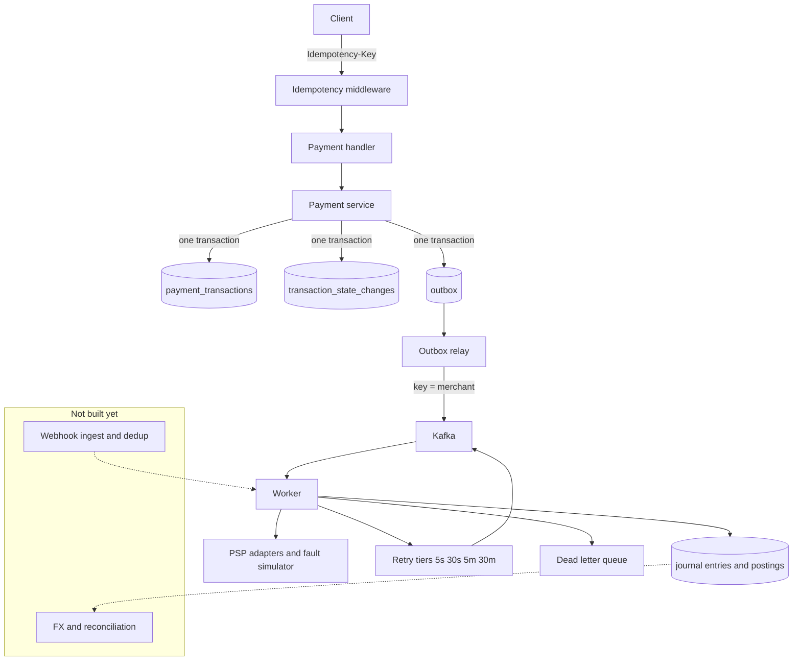

# Payment Orchestration Platform

[](https://github.com/lqtrung-95/payment-orchestration/actions/workflows/ci.yml)

A multi-PSP payment orchestrator in Go, built around one idea: **everything
interesting in a payment system comes from things going wrong.**

A provider that times out *after* charging the card. A webhook delivered five
times, out of order, before the API call that created the transaction returned.
A settlement file that disagrees with your ledger by three cents. The happy path
is a CRUD app; the failure paths are the actual problem.

> **Status: in progress — 4 of 10 phases complete.**
> Built and tested: ledger, state machine, idempotency, provider abstraction, a
> provider simulator that fails on purpose, and an asynchronous pipeline —
> transactional outbox, Kafka, error-aware retries, DLQ.
> Webhook ingestion and reconciliation are not built yet.
> Everything claimed below is verified by tests in this repo — see
> [Verified behaviour](#verified-behaviour). Nothing here is aspirational; the
> roadmap is kept separate, at the bottom.

---

## The guarantees, and what enforces them

The design principle throughout: **a rule that matters is enforced by the
database, not by convention.** Application code gets bypassed by migrations,
admin sessions, and repair scripts. Money bugs found in production are almost
never "someone forgot to validate" — they are "the validation existed in one of
the four places that write this table."

| Guarantee | Enforced by | Bypassable? |
|---|---|---|
| Journal entries balance per currency | `DEFERRABLE` constraint trigger, fires at COMMIT | No |
| Ledger history is immutable | `BEFORE UPDATE OR DELETE` triggers reject both | No |
| A posting can't touch a different-currency account | Composite FK on `(account_id, currency)` | No |
| Can't capture more than authorised | `CHECK (captured_minor <= amount_minor)` | No |
| Can't refund more than captured | `CHECK (refunded_minor <= captured_minor)` | No |
| Illegal state transitions | Trigger against a transition table **+** Go aggregate | No |
| One key ⇒ one execution | `UNIQUE (merchant_id, key)` inside a committed tx | No |
| Concurrent writers can't clobber | `version` column, optimistic lock | No |
| A payment is never failed on an unknown outcome | `GetStatus` recovery; unresolved stays non-terminal | No |
| Queued work is never lost or invented | Outbox row written in the domain transaction | No |
| A declined payment is never retried | Retry policy keyed on the error class | No |

Three of these deserve explanation.

**Balance is checked at COMMIT, not at INSERT.** A journal entry is legitimately
unbalanced between its first and last posting, so a normal trigger would reject
every valid entry. A `DEFERRABLE INITIALLY DEFERRED` constraint trigger fires
once, at commit, when the entry is whole.

**The state machine is declared twice** — as a map in Go and as rows in
Postgres — and a test proves the two identical. Two encodings of one rule drift
apart unless something compares them, and a drift means the application believes
a transition is legal that the database will reject at runtime, or worse, the
reverse.

**Idempotency ownership is decided by a unique constraint, not a read-then-write.**
The claim is committed *before* the handler runs. Until the in-flight row is
visible to other connections, a concurrent request carrying the same key finds
nothing and concludes it may proceed — which is precisely how double charges
happen.

## Balances are derived, never stored

`postings` are insert-only; balances are computed by aggregating them. A stored
balance is a second source of truth that drifts from the entries it summarises,
and once it has drifted there is no way to tell which of the two is wrong.

The ledger records **money that moved, not intent**. Creating or authorising a
payment posts nothing — an authorisation is a hold at the issuer, not a
transfer. Postings begin at capture. Booking authorisations would inflate every
balance by the value of holds that may never be captured, and reconciliation
against a settlement file would never match.

Money is `int64` minor units plus an ISO-4217 currency, with no float
constructor anywhere in the codebase. Proportional amounts (fees, splits) go
through an allocation that distributes the truncation remainder, so parts always
sum back to the original exactly.

## Failure handling

A provider call can fail in a way that says nothing about whether the money
moved: the charge is recorded and the response is lost. Retrying charges twice.
Marking it failed writes off money the customer actually paid. Every provider
error is normalized into one of three categories, each with a different answer:

| Category | Examples | Response |
|---|---|---|
| **Terminal** | declined, insufficient funds, suspected fraud | Fail it. Never retry. |
| **Retryable** | rate limited, provider unavailable | Leave open. Nothing happened. |
| **Ambiguous** | timeout, network error, **HTTP 500** | Ask `GetStatus`. Never retry blind. |

A 500 is ambiguous, not a failure — the provider may have recorded the charge
and then fallen over while replying. An unrecognised error also defaults to
ambiguous, because guessing "it failed" is how a real payment gets lost.

When nothing can be established — the provider is unreachable, or its status
endpoint lags — the transaction stays **non-terminal** and says so. A false
"authorized" is recoverable by reconciliation; a false "failed" is money quietly
gone. See [ADR 0006](docs/adr/0006-ambiguous-provider-outcomes-are-resolved-not-guessed.md).

### Retries are driven by the error class

"Retry everything a few times" is wrong in both directions — it repeats declines
and it retries ambiguous failures blindly. The policy is keyed on the taxonomy:

| Class | Policy |
|---|---|
| `Timeout`, `NetworkError` | Retry, but confirm via `GetStatus` first |
| `Unknown` | One confirmation attempt, then alert |
| `RateLimited`, `Unavailable` | Retry on the slower tiers |
| `Declined`, `InsufficientFunds`, `DoNotHonor` | **Never** |
| `SuspectedFraud` | Never, and alert |
| `InvalidInstrument` | Never, until re-verified |

Delay is modelled as four topics (5s / 30s / 5m / 30m) whose consumers wait
until a message is due, not as sleeps inside a handler — a consumer restart must
not lose scheduled retries. Backoff uses **full jitter**, because callers that
back off deterministically all wake at the same instant and knock a recovering
provider straight back over.

Exhausting the ladder parks the message in a DLQ with its reason and origin.
Nothing is dropped. `dlqctl` lists and replays, and replay demands `--actor` and
`--reason` — it moves money, and the first question afterwards is always who
decided to.

### The provider misbehaves on purpose

`cmd/pspsim` is a separate process implementing a deliberately unreliable
provider. Faults are tunable at runtime — the demo is toggling them while
traffic flows — and every verdict is derived from a seed plus the request
identity, so a chaos run replays exactly rather than approximately.

| Fault | What it forces |
|---|---|
| `timeout_after_success` | Charge recorded, connection hangs. The flagship case. |
| `error_5xx_after_success` | Same, wearing an HTTP status code |
| `duplicate_webhook` | Deduplication (Phase 05) |
| `out_of_order_webhook` | State guards on stale events (Phase 05) |
| `webhook_before_response` | Webhook arriving before the API reply (Phase 05) |
| `slow_response` | Timeout budgets |
| `partial_capture_drift` | A reconciliation break, not an error |
| `stale_status` | Recovery cannot assume the provider is read-consistent |

Three provider shapes, deliberately not interchangeable: synchronous,
asynchronous (resolves only by webhook), and redirect-based (3-D Secure style).
Two adapters with identical semantics would prove nothing.

Declines are triggered by magic amounts, the way real sandboxes work — the last
two digits are the actual ISO-8583 response code, so an amount ending in `51`
declines for insufficient funds.

## Verified behaviour

Measured on this repo, not projected. 109 tests, green in
[CI](https://github.com/lqtrung-95/payment-orchestration/actions/workflows/ci.yml)
against a real Postgres.

**Idempotency, end to end over HTTP** — 50 concurrent `POST /v1/payments`
carrying one idempotency key, with a real provider call in the request path:

```
41 × 201   (1 execution + 40 replays)
 9 × 409   (in-flight, told to retry)
------------------------------------
transactions created:  1
provider charges:      1
```

Replays are **byte-identical** to the original response. Reformatted JSON — same
content, reordered keys, different whitespace — still replays rather than being
rejected. The same key with a *different* body returns 409 rather than silently
replaying, which would discard the second payment.

**Money** — a 20,000-case property test asserts allocation never creates or
destroys a minor unit, for any amount and any ratios. Overflow is detected on
add, subtract, negate, multiply, and inside allocation.

**Ledger** — unbalanced entry rejected at commit; empty entry rejected;
cross-currency posting rejected; `UPDATE`/`DELETE` on postings rejected. Invariant
`sum(debits) = sum(credits)` holds across a 25-entry three-way fee split.

**Concurrency** — 20 concurrent writers on one transaction: version advances
exactly once per winner, every loser gets a typed conflict error rather than
silently losing its write.

**Ambiguous-failure recovery** — with `timeout_after_success` forced to 100%,
and again with `error_5xx_after_success` at 100%: the transaction reaches
`authorized` with **exactly one charge** at the provider. The tests assert the
audit trail contains *recovered after ambiguous failure*, so they cannot pass
vacuously if the fault stops firing.

**Nothing terminal without evidence** — provider outage, and the provider
process killed outright mid-flow: the transaction stays `authorizing`, never
`failed`. Only a genuine decline reaches a terminal state.

**Reproducible chaos** — the same seed produces identical fault verdicts
regardless of call order or concurrency; different seeds diverge.

**Asynchronous pipeline, over real Kafka** — create → outbox → relay → Kafka →
worker → authorized, with isolated topics per test run. A decline reaches
`failed` with zero provider charges and zero retry-tier messages. A duplicate
delivery does not run the work twice. Exhausted retries land in the DLQ without
the transaction being marked failed.

**No duplicate publishes** — four concurrent publishers over 120 messages
deliver each exactly once. This test caught a real bug: `FOR UPDATE SKIP LOCKED`
alone released its locks when the claim transaction committed, so every
publisher re-sent the same batch. Claiming by lease fixed it.

**A rolled-back payment leaves no queued work**, and a committed one leaves
exactly one message — the property the outbox exists for.

## Try it

Requires Go 1.26+ and a container runtime.

```bash
cp .env.example .env
make up            # postgres, redis, kafka — waits until healthy
make migrate-up
make run
```

Start the worker and the provider simulator in separate terminals:

```bash
make pspsim        # the provider that fails on purpose
make worker        # consumes Kafka, calls providers
```

Create a payment:

```bash
curl -X POST http://localhost:8080/v1/payments \
  -H 'X-Merchant-Id: m_acme' \
  -H 'Idempotency-Key: order-1001' \
  -H 'Content-Type: application/json' \
  -d '{"amount":12550,"currency":"USD"}'
```

The response comes back in the `created` state in a few tens of milliseconds:
authorization happens in the worker, so the caller never waits on a third party.
`GET /v1/payments/{id}` shows it reach `authorized`.

Send it again with the same key — you get the identical response and an
`Idempotency-Replayed: true` header, and no second transaction. Send it with a
different amount and the same key, and you get a 409.

Amounts are integer minor units. `{"amount":125.50}` is rejected at the boundary
rather than truncated, and so is a typo like `"currrency"`.

Run it against the misbehaving provider:

```bash
make pspsim        # separate process, so it can be killed mid-flow
make chaos         # switch fault injection on while traffic flows
make outage        # take the provider down for 30s
```

```bash
make test          # includes integration tests against the live stack
make check         # fmt, vet, lint, test
```

## Architecture



Solid edges exist today. The boxed subgraph and the dotted edges into it do not.

The transaction, its audit row, and the queue message are written in **one**
database transaction — that atomicity is what makes queued work neither lost nor
invented. Postings begin at capture, which has no HTTP surface yet.

One service with enforced module boundaries, deliberately not microservices — a
distributed monolith would be a worse design, not a better one, at this size.

```
cmd/          orchestrator, worker, migrate, pspsim, dlqctl
internal/
  domain/     money, ledger, transaction   — no I/O, no framework types
  store/      repositories                  — take a Querier, so callers own the tx boundary
  psp/        provider contract, error taxonomy, retry policy, adapters
  simulator/  the provider that fails on purpose
  outbox/     transactional outbox writer and relay
  messaging/  Kafka topics, producer, consumer group
  worker/     queue handlers, dedup
  resilience/ backoff with full jitter, circuit breaker
  service/    orchestration
  transport/  Hertz handlers + middleware
  platform/   postgres, redis, kafka, telemetry, sharding
migrations/   embedded in the binary
```

Repositories accept a `Querier` satisfied by both a pool and a transaction. That
is what will let the transactional outbox commit a domain write and an outbox
write together — the guarantee is lost the moment they can be split.

## Design decisions

Written when the decision was made, not reconstructed afterwards. Each records
the alternatives that were seriously considered and rejected.

- [0001 — Money as integer minor units](docs/adr/0001-money-as-integer-minor-units.md)
- [0002 — Double-entry ledger with derived balances](docs/adr/0002-double-entry-ledger-with-derived-balances.md)
- [0003 — Shard key is merchant_id](docs/adr/0003-shard-key-is-merchant-id.md)
- [0004 — Idempotency: scope, fingerprint, and fencing](docs/adr/0004-idempotency-scope-fingerprint-and-fencing.md)
- [0005 — Transition matrix enforced in two places](docs/adr/0005-transition-matrix-enforced-in-two-places.md)

## Known gaps

Stated plainly, because a README that omits them is not worth reading.

- **No authentication.** `X-Merchant-Id` is an unauthenticated header — any
  caller can claim to be any merchant. The tenant isolation is only as real as
  that header. Must be replaced before this is exposed anywhere.
- **No reaper for expired idempotency records**, so that table grows unbounded.
- **Capture and refund have no HTTP surface.** Both exist on the aggregate and
  are tested, but need a provider to be meaningful.
- **Sharding is decided, not implemented.** The key is derived and stored on
  every row; routing across physical databases comes later. Storing it now is
  the point — backfilling a shard key across a populated ledger means rewriting
  every row while the service stays online.
- **No throughput numbers yet.** Load testing is Phase 09. This README will not
  carry a throughput figure until one has actually been measured.
- **No Stripe adapter.** It needs a real Stripe account and key. The interface
  and registry are built so it slots in without touching orchestration.
- **Consumer lag is not exported.** A message stuck in a retry tier is invisible
  without inspecting Kafka by hand; Phase 09 fixes this.
- **`processed_events` grows unbounded** — it needs a pruning job.
- **The DLQ needs someone to watch it.** A dead letter queue nobody looks at is
  a slower way of dropping messages.

## Roadmap

| # | Phase | Status |
|---|---|---|
| 01 | Service skeleton, config, migrations, CI | Done |
| 02 | Ledger, transaction state machine, idempotency | Done |
| 03 | PSP abstraction + deliberately misbehaving simulator | Done |
| 04 | Transactional outbox → Kafka → retry ladder → DLQ | Done |
| 05 | Webhook ingest, dedup, out-of-order tolerance | Next |
| 06 | Payment instrument binding + lifecycle | |
| 07 | FX conversion + settlement reconciliation | |
| 08 | Sharding + cross-shard transactions (TCC) | |
| 09 | OpenTelemetry, load + chaos testing | |
| 10 | Architecture docs and demo | |

Phase 05 answers the inbound half: webhooks arriving duplicated, out of order,
and sometimes before the API call that created the transaction has returned. The
faults for all three already exist in the simulator, waiting for a receiver.
