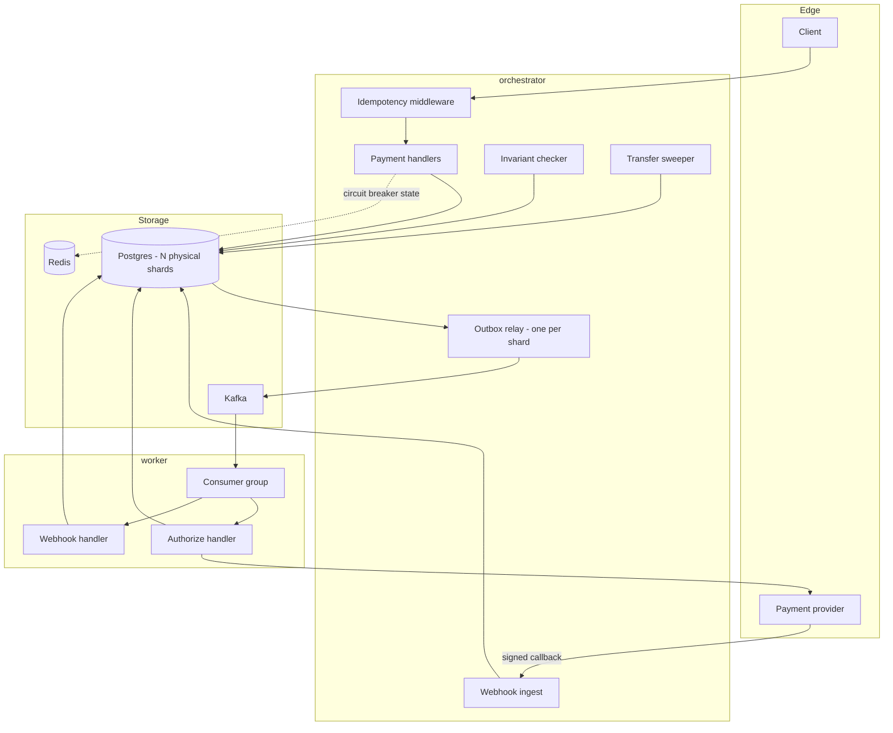
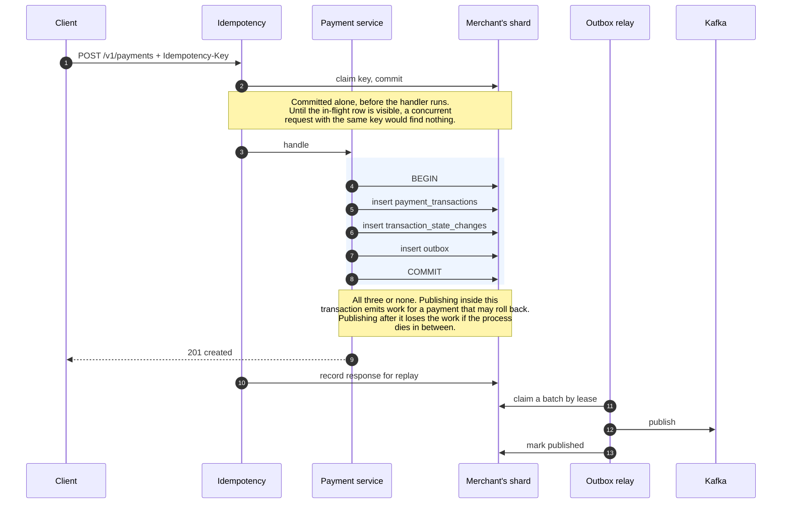
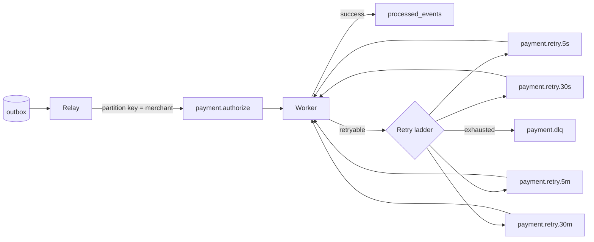
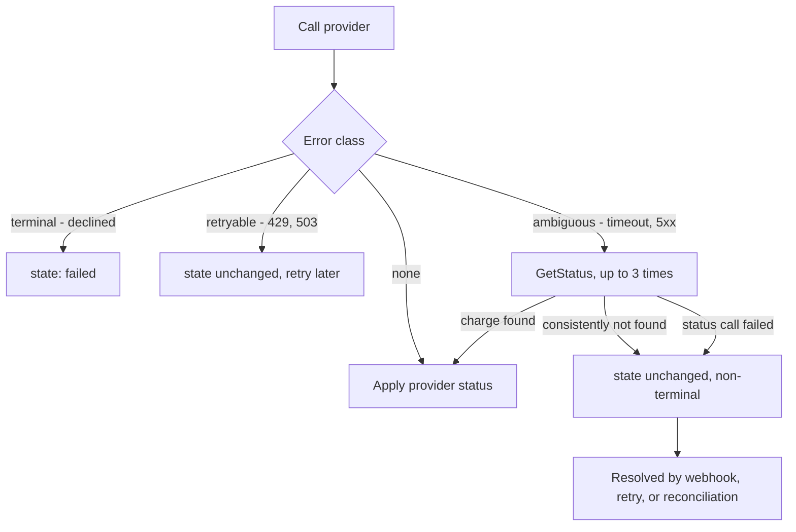
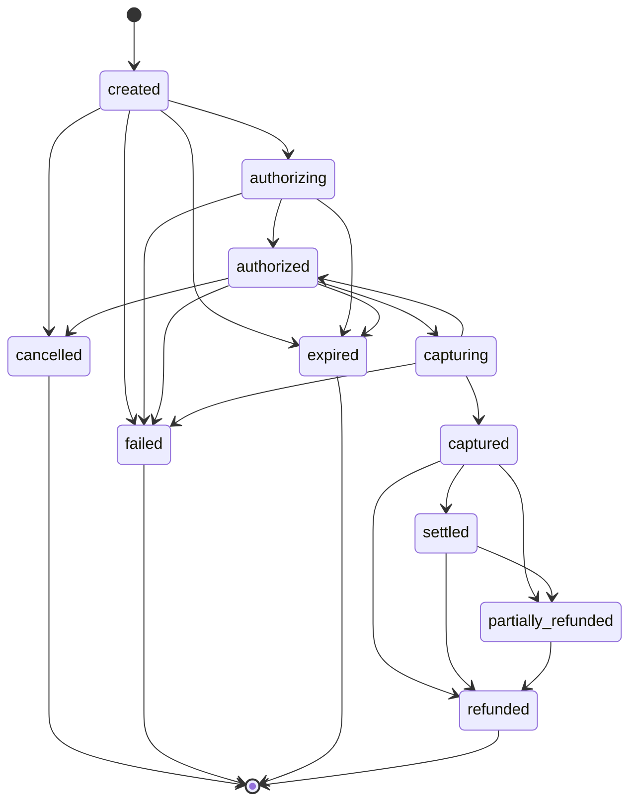
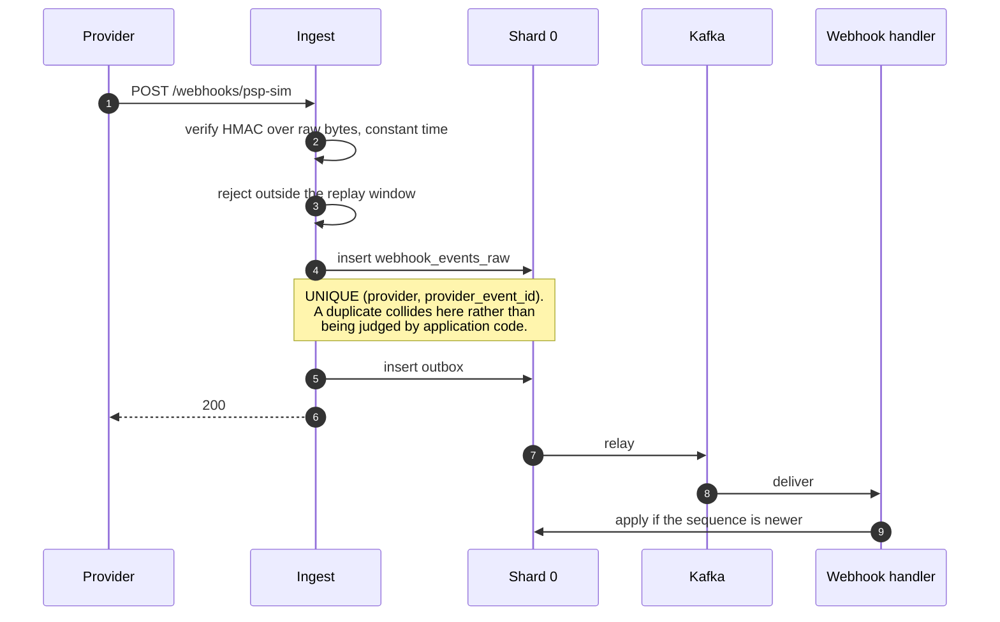
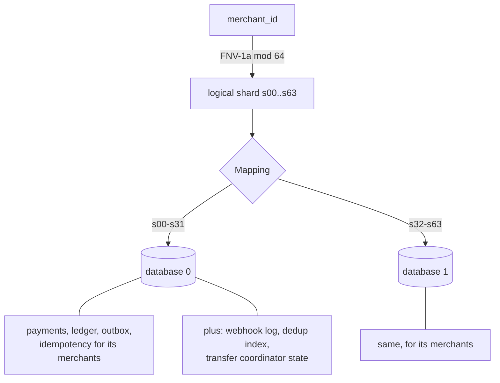
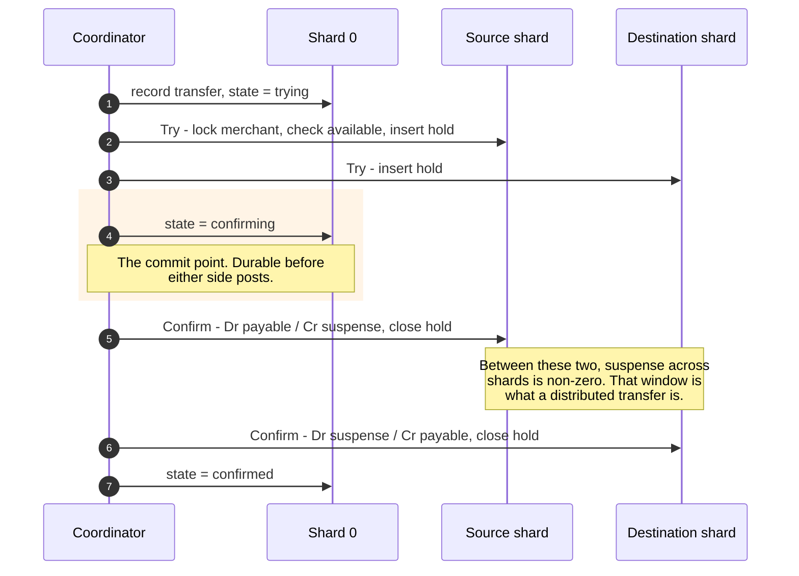
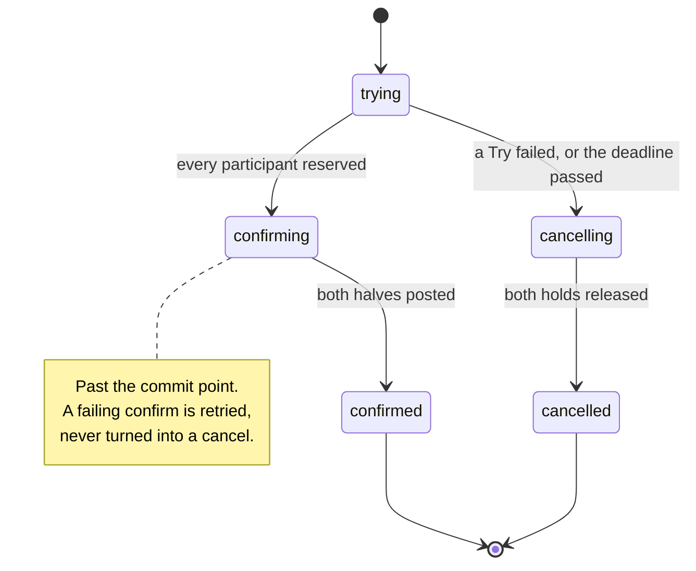

# System Architecture

How the pieces fit together. The *why* behind each decision lives in
[`docs/adr/`](adr/) and is linked from the relevant section rather than repeated
here; the README is the short version of both.

One service, module boundaries enforced by package structure, deliberately not
microservices ([ADR 0014 rationale is in the README](../README.md#architecture)).
Two binaries run it: `orchestrator` serves HTTP and relays the outbox,
`worker` consumes Kafka and talks to providers.

---

## 1. Components



Redis is deliberately marginal. It holds nothing that cannot be rebuilt: no
balance, no dedup decision, no payment state. Every correctness claim in this
system is enforced by Postgres, because a cache that is consulted for a decision
is a second source of truth ([ADR 0002](adr/0002-double-entry-ledger-with-derived-balances.md)).

### HTTP surface

| Route | Purpose |
|---|---|
| `POST /v1/payments` | Create. Returns in `created`; authorization is asynchronous. |
| `GET /v1/payments/:id` | Read, scoped to `X-Merchant-Id`. |
| `POST /v1/payments/:id/capture` | Capture, in full or partially. |
| `POST /webhooks/:provider` | Provider callbacks. Public, signature-verified. |
| `GET /healthz` `GET /readyz` | Liveness, and readiness across every shard. |
| `GET /metrics` | Prometheus, including the must-be-zero gauges. |

Command-line surfaces for operations: `dlqctl`, `webhookctl`, `reconctl`,
`transferctl`, `migrate`.

---

## 2. The write path is one transaction



The claim is a **lease**, not a lock: the relay pushes `available_at` forward,
so rows stay invisible to other relays without holding a transaction open across
network I/O. A relay that dies stops renewing and its rows become claimable
again ([ADR 0007](adr/0007-transactional-outbox-and-error-aware-retries.md)).

Delivery is at-least-once by construction — a row is marked published only after
the broker acknowledges it. A duplicate is absorbed downstream; a lost payment
event has nothing to recover it.

---

## 3. The asynchronous pipeline



Partitioned by merchant, so every event for one merchant is ordered against the
others.

**The retry tiers are topics, not sleeps.** A handler that slept would block the
single goroutine walking that partition — which is exactly the bug this design
came from: one message on the 5-minute tier held twenty unrelated payments at
`created`. Messages are deferred by pausing and rewinding the partition, so a
not-yet-due record is left unconsumed rather than held.

Which rung a failure takes is decided by its **class**, not by a retry count.
A decline is terminal and is never retried; a rate limit skips to a slow rung; an
ambiguous outcome is not retried at all until the provider has been asked what
happened.

Nothing is ever dropped. A message that exhausts the ladder goes to the DLQ with
its attribution intact, and `dlqctl` can replay it.

---

## 4. Provider outcomes

The hard case is the ambiguous one: a timeout or a 5xx that may or may not have
charged the customer.



`not found` is re-asked because a provider's status endpoint is often served
from a replica that lags its write path. Believing it once would licence a retry
against a charge that already exists.

An unresolved outcome stays non-terminal forever rather than being guessed.
Marking it failed loses a payment the customer was charged for; marking it
succeeded invents one ([ADR 0006](adr/0006-ambiguous-provider-outcomes-are-resolved-not-guessed.md)).

---

## 5. Transaction state machine



Two edges are worth naming:

- **`capturing → authorized`** exists so a capture that failed for a retryable
  reason can be reattempted without putting the customer through authorisation
  again.
- **`authorizing → expired`** covers a redirect-based authorisation the customer
  never finished, which is otherwise indistinguishable from one still in flight.

A same-state transition is legal and is recorded as *ignored* rather than as a
move. A payment resolved by the recovery path and then confirmed by its webhook
would otherwise show two `authorized` rows for one event.

The matrix is enforced in Go **and** mirrored in `transaction_state_transitions`,
with a test asserting the two are identical. Two encodings of one rule drift
apart unless something compares them ([ADR 0005](adr/0005-transition-matrix-enforced-in-two-places.md)).

---

## 6. Webhook ingestion



Three properties, each with a reason:

- **The payload is stored as bytes, not JSONB.** The signature was computed over
  those exact bytes; normalising them means the stored event can never be
  verified again.
- **The 200 is returned before the event is applied.** A provider that does not
  get a prompt acknowledgement retries, and retrying an event already accepted is
  how one delivery becomes twenty.
- **Staleness is judged by the provider's own sequence**, not arrival order.
  Timestamps come from whichever provider host emitted the event, and two hosts
  routinely disagree about which came first. `payment_transactions.last_applied_event_seq`
  is the guard.

`webhookctl replay` re-evaluates the whole stored log against current state and
reports what would change. A healthy log changes nothing
([ADR 0008](adr/0008-webhook-ingestion-and-ordering.md)).

---

## 7. Sharding topology



The logical count is fixed at 64. The physical count is configuration,
constrained to a power of two that divides 64 — which is what makes doubling
capacity a split of each range exactly in half, and therefore a contiguous bulk
copy rather than a rehash of every row while the service is live.

Routing reads the **stored** key, never re-derives it. Re-deriving would let a
change in the hash function send reads to a database that does not hold the rows.

### Who lives where

| Data | Location | Reason |
|---|---|---|
| `payment_transactions`, `transaction_state_changes` | Merchant's shard | Partitioned by merchant. |
| `ledger_accounts`, `journal_entries`, `postings` | Merchant's shard | Balances are derived per merchant. |
| `outbox` | Merchant's shard | Written in the same transaction as the domain change; it can live nowhere else. One relay per shard follows. |
| `idempotency_keys` | Merchant's shard | Co-located with the payment the claim guards, so a shard outage takes both. |
| `fee_schedules`, `fx_rates`, `fx_rate_locks` | Every shard | Read inside shard transactions. Replicated reference data. |
| `webhook_events_raw` | Shard 0 | An event arrives before any payment has been resolved from it. |
| `processed_events` | Shard 0 | An event id carries no merchant; one unique index arbitrates for every message. |
| `settlement_*`, `recon_*` | Shard 0 | Per-provider back-office records, not per-merchant. |
| `tcc_transfers` | Shard 0 | Spans two merchants and belongs to neither shard. |
| `tcc_reservations` | Participant's shard | Reserving checks a balance and records the hold in one transaction; the balance is there. |

Concentrating the unpartitioned tables makes shard 0 hotter. That is accepted:
the alternative is cross-shard consistency for data with no partition key.

**There is no API to open a transaction across shards.** Postgres cannot commit
across databases, so such a method could only be two transactions wearing one
name ([ADR 0010](adr/0010-physical-sharding-and-cross-shard-transfers.md)).

---

## 8. Cross-shard transfers





**The commit point is the design.** Before it, the transfer may be cancelled
freely because nothing was posted. After it, every participant has agreed and
the transfer is owed completion. That single rule is what lets the sweeper look
at a transfer whose coordinator died and know what to do without asking anyone.

Each shard posts a balanced entry — the balance trigger is per-entry and the
databases share nothing — against a suspense account:

```
source shard:       Dr merchant payable    Cr transfer suspense
destination shard:  Dr transfer suspense   Cr merchant payable
```

So the suspense position summed across every database is zero whenever nothing
is in flight, and a non-zero total is precisely the signal that one half
completed and the other did not.

Available balance is the derived payable balance minus outstanding holds, read
and written under a transaction-scoped advisory lock on the merchant and
currency. Without it, two transfers of 600 against 1,000 both pass a check that
was correct when it ran.

---

## 9. Where each invariant is enforced

Nothing important is enforced only in Go. Application code can be bypassed by a
migration, an admin session, or a repair script.

| Invariant | Enforced by |
|---|---|
| An entry's debits equal its credits, per currency | `DEFERRABLE INITIALLY DEFERRED` constraint trigger, checked at COMMIT once all postings exist |
| Ledger history is immutable | `BEFORE UPDATE OR DELETE` trigger raising `restrict_violation` |
| A posting's currency matches its account | Composite foreign key `(account_id, currency)` |
| Captured never exceeds authorised | `CHECK` on `payment_transactions` |
| One account per owner, purpose, and currency | `UNIQUE` natural key |
| One webhook event applied once | `UNIQUE (provider, provider_event_id)` |
| One reservation per side of a transfer | `UNIQUE (transfer_id, role)` |
| A confirmed reservation has an entry | `CHECK ((state = 'confirmed') = (entry_id IS NOT NULL))` |
| Concurrent captures cannot both win | Optimistic locking on `version` |
| Concurrent spends cannot overdraw | `pg_advisory_xact_lock` on merchant and currency |

On top of those, three gauges are computed continuously from committed state and
must read zero: `payment_ledger_imbalance`, `payment_double_charges`,
`payment_lost_payments`. They are queried on every shard and summed, and the
checker itself is tested against planted violations — one that always returned
zero would pass every load test ever run against it.

---

## 10. Module boundaries

```
cmd/          orchestrator, worker, migrate, pspsim,
              dlqctl, webhookctl, reconctl, transferctl
internal/
  domain/     money, ledger, transaction, fx, fee   — no I/O, no framework types
  store/      repositories — take a Querier, so the caller owns the tx boundary
  psp/        provider contract, error taxonomy, retry policy, adapters
  simulator/  the provider that fails on purpose
  outbox/     transactional outbox writer and relay
  messaging/  topics, producer, consumer group with partition-level deferral
  worker/     queue handlers, router, dedup
  webhook/    ingest, per-provider verifiers, guarded processor, replay
  recon/      settlement parsing, matching, break taxonomy, resolution
  tcc/        cross-shard transfers: coordinator, participants, sweeper
  invariant/  continuous must-be-zero checks, queue depth, consumer lag
  resilience/ backoff with full jitter, circuit breaker
  service/    orchestration
  transport/  Hertz handlers and middleware
  platform/   postgres pools and shard router, redis, kafka, telemetry, sharding
migrations/   embedded in the binary
```

The `Querier` interface — satisfied by both a pool and a transaction — is what
lets a domain write and an outbox write commit together. The shard router sits
above it and exposes no method spanning two databases, so that guarantee cannot
be split by accident either.

---

## 11. Observability

Trace context crosses two boundaries by two different mechanisms, because they
are different problems:

- **Kafka** carries it in record headers. The producing goroutine is long gone
  when a consumer picks the record up.
- **The outbox** carries it in the database row. The handler commits and returns
  while the relay publishes later in another goroutine. Without the stored
  `traceparent` the trace starts at the relay, and the request that caused the
  payment is missing from its own story.

A single trace therefore spans `POST /v1/payments` → `kafka.publish` →
`kafka.consume` → the provider call, across two processes.

Published latency figures are always measured with tracing **off**. Sampling at
100% while measuring latency makes the exporter part of what is being measured.
Numbers, hardware, and commands are in [`docs/benchmarks/`](benchmarks/README.md).

---

## 12. Not built

Stated here because an omitted component is easily mistaken for an implied one.

- **No authentication.** `X-Merchant-Id` is an unauthenticated header. Tenant
  isolation is only as real as that header, and it is the reason transfers have
  a CLI rather than an HTTP endpoint.
- **No resharding tooling.** The mapping supports growth; nothing copies rows
  between databases or coordinates a cutover.
- **No balance cache.** Balances are derived from postings on every read.
- **No payment instrument vault.** Phase 06 was skipped; nothing stores tokens.
- **Refunds have no HTTP surface**, and refund settlement rows are not
  classified.
- **The settlement entry is not written.** FX drift posts to fx gain/loss, but
  nothing moves the balance out of clearing into the bank.
- **`processed_events` and `webhook_events_raw` grow unbounded.** Both need
  pruning, and the raw payloads may carry PII.
- **Worker concurrency is one goroutine per consumer.** Ingestion scales;
  processing does not. Concurrent per-partition consumers would change the
  ordering the retry ladder depends on.
